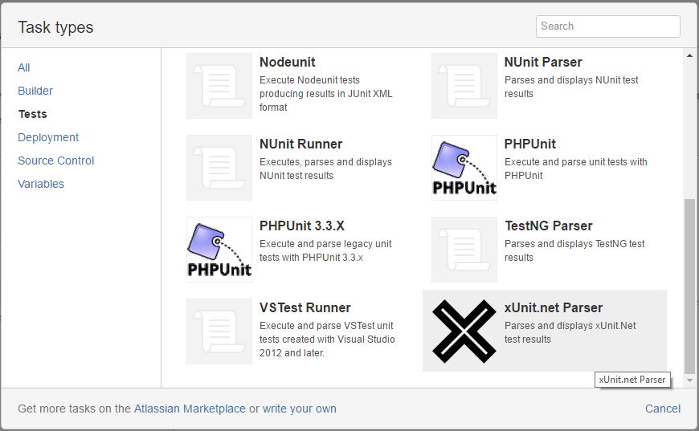
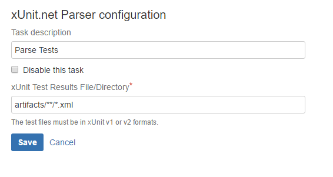
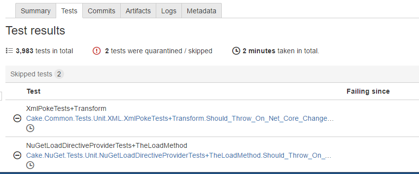

# Atlassian Bamboo xUnit.Net Parser Plugin

This plugin adds an xUnit Parser Task to Atlassian's Bamboo Server. The parser supports v1 and v2 xunit test result formats.

## How to use

Add the task to your build job.

Enter the path to the xunit result file/s. This can be a filepath, a directory path, or a wildcard path relative to the build root directory.

Run your build plan and view the results in the test tab.

